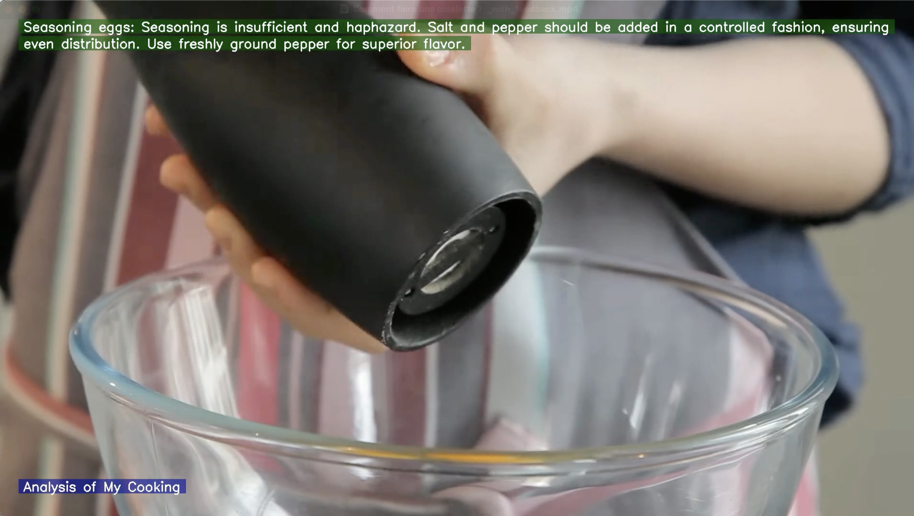

# AI Cooking Coach

> **AI Cooking Coach** is a Python application that uses Google's Gemini Pro Vision to analyze your cooking videos and provide step-by-step feedback, just like a personal cooking instructor. It generates a new video with feedback overlaid directly on your original footage.

---

## 🚀 Features

- **AI-Powered Analysis:** Leverages the Gemini API's multimodal capabilities to understand and comment on cooking techniques shown in a video.
- **Customizable Persona:** Choose your coach's style—from Gordon Ramsay's tough love to Julia Child's encouragement—by editing the prompt.
- **Video Feedback Overlay:** Feedback appears at the precise moments actions occur in your video.
- **Audio Preservation:** The original audio is included in the final output.
- **Secure & Structured:** API keys are managed securely using environment variables.

---

## 🧑‍🍳 How It Works

### 1. AI Analysis (`analyzer.py`)
- The script sends your video and a detailed prompt to the Gemini API.
- The AI analyzes the video and returns a structured JSON file with timestamped feedback.

**Sample Output:**
```json
{
  "analysis": [
    {
      "timestamp": "00:14-00:15",
      "action": "Cracking eggs",
      "feedback": "Technique is acceptable, but lacks precision. Crack the eggs on a flat surface to avoid shell fragments."
    },
    {
      "timestamp": "00:16-00:18",
      "action": "Seasoning",
      "feedback": "Good amount of salt and pepper, but seasoning before whisking can make the eggs watery. It's better to season in the pan."
    }
  ],
  "summary": {
    "title": "Analysis of My Cooking",
    "overall_feedback": "A solid attempt. Your fundamentals are there, but focus on refining your technique for a more professional result. Pay attention to heat management and the timing of your seasoning."
  }
}
```

### 2. Video Visualization (`visualizer.py`)
- Reads the generated JSON and original video.
- Uses OpenCV to draw feedback text onto each frame at the correct timestamp.
- Uses moviepy to combine the new video track with the original audio.

---

## 💡 Feedback Examples

- *"Technique is acceptable, but lacks precision. Crack the eggs on a flat surface to avoid shell fragments."*
- *"Good amount of salt and pepper, but seasoning before whisking can make the eggs watery. It's better to season in the pan."*

<p align="center">
    
</p>

<p align="center">
    
</p>

---

## 🛠️ Setup and Installation

### 1. Clone the Repository
```bash
git clone <your-repo-url>
cd ai-cooking-coach
```

### 2. Create a Virtual Environment
**For Mac/Linux:**
```bash
python3 -m venv venv
source venv/bin/activate
```
**For Windows:**
```bash
python -m venv venv
.\venv\Scripts\activate
```

### 3. Install Dependencies
```bash
pip install -r requirements.txt
```

### 4. Set Up Your API Key
- Create a file named `.env` in the root directory.
- Add your API key:
  ```env
  GEMINI_API_KEY="YOUR_API_KEY_HERE"
  ```
- The `.gitignore` is already configured to keep this file private.

---

## ▶️ How to Run

1. **Place your video:** Put the cooking video you want to analyze into the `videos/input/` directory.
2. **Run the main script:**
   ```bash
   python main.py "videos/input/your_video_name.mp4"
   ```
3. **Check the output:**
   - The AI's analysis will be saved as a JSON file in the `analysis_results/` folder.
   - The final video with feedback overlay will be saved in the `videos/output/` folder.

---

## 📄 License

This project is licensed under the MIT License. See the LICENSE file for details.

> **Build your own AI-powered cooking coach or integrate it into your product!**